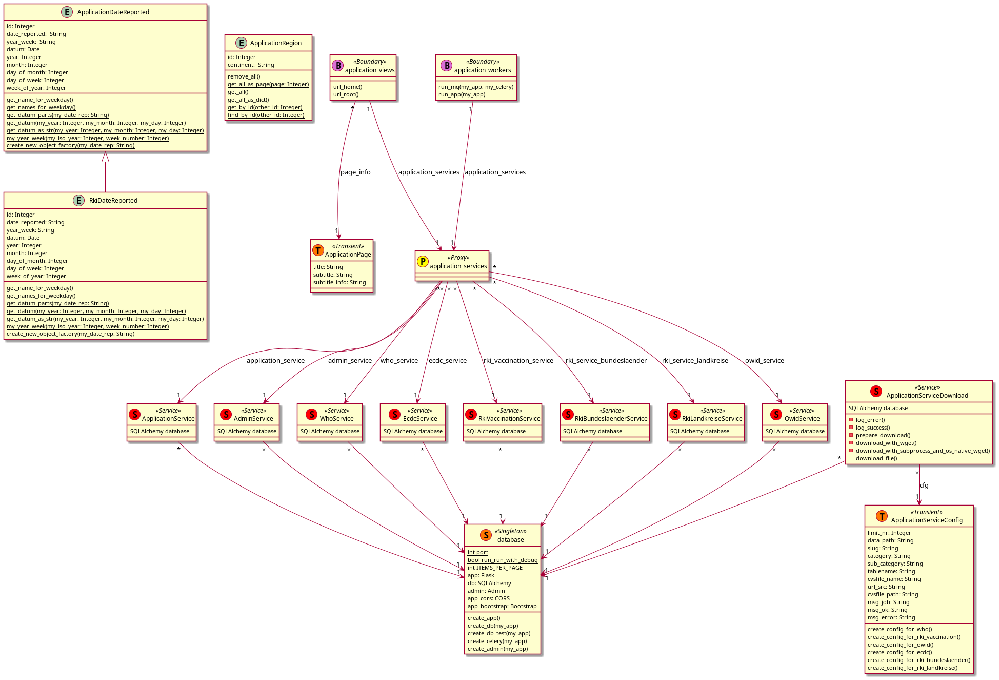
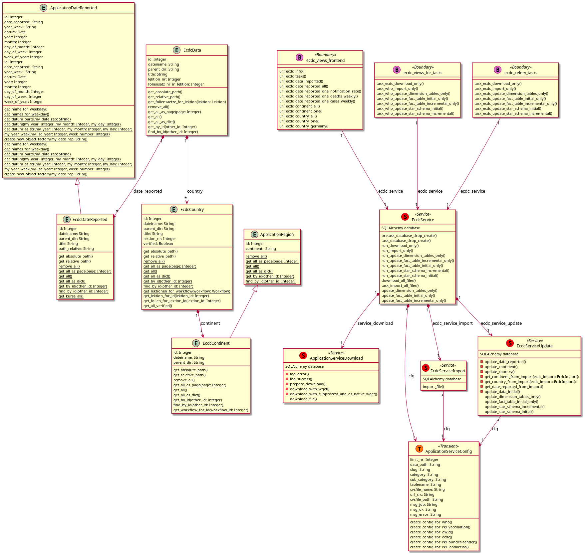
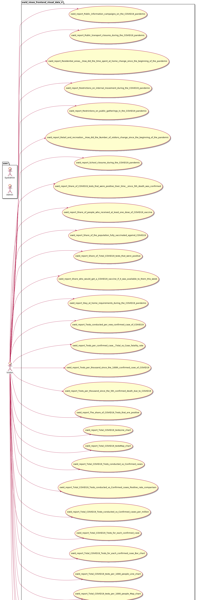

# covid19python
* Version 0.0.21

## git
* github: https://github.com/thomaswoehlke/covid19python.git

## Data Sources:
* [WHO](https://covid19.who.int/WHO-COVID-19-global-data.csv)
* [ecdc.europa](https://opendata.ecdc.europa.eu/covid19/casedistribution/csv)
* [ecdc.europa - Information](https://www.ecdc.europa.eu/en/publications-data/download-todays-data-geographic-distribution-covid-19-cases-worldwide)

## Python
* [flask](https://flask.palletsprojects.com/en/1.1.x/)
* [flask: pypi](https://pypi.org/project/Flask/)
* [flask: flask-admin](https://github.com/flask-admin/flask-admin/)
* [flask: werkzeug](https://werkzeug.palletsprojects.com/en/1.0.x/)
* [flask: sqlalchemy](https://flask.palletsprojects.com/en/1.1.x/patterns/sqlalchemy/)
* [sqlalchemy](https://docs.sqlalchemy.org/en/13/)
* [sqlite](https://sqlite.org/docs.html)
* [jinja](https://jinja.palletsprojects.com/en/2.11.x/)
* [jinja: markupsafe](https://palletsprojects.com/p/markupsafe/)
* [jinja: itsdangerous](https://palletsprojects.com/p/itsdangerous/)
* [jinja: click](https://palletsprojects.com/p/click/)

### Info
* http://www.leeladharan.com/sqlalchemy-query-with-or-and-like-common-filters
* https://riptutorial.com/flask/example/22201/pagination-route-example-with-flask-sqlalchemy-paginate

### Dependencies
* https://pip.pypa.io/en/latest/user_guide/#fixing-conflicting-dependencies

## UML Blueprints
### admin
#### admin_domain_model

#### admin_use_cases

### application
#### application_domain_model

#### application_use_cases

### ecdc
#### ecdc_domain_model

#### ecdc_use_cases

### owid
#### owid_domain_model

#### owid_use_cases

#### owid_use_cases_visual_data_1

#### owid_use_cases_visual_data_2

#### owid_use_cases_visual_data_3

#### owid_use_cases_visual_data_4

#### owid_use_cases_visual_data_5

### rki_vaccination
#### rki_vaccination_domain_model

#### rki_vaccination_use_cases

### who
#### who_domain_model

#### who_use_cases

