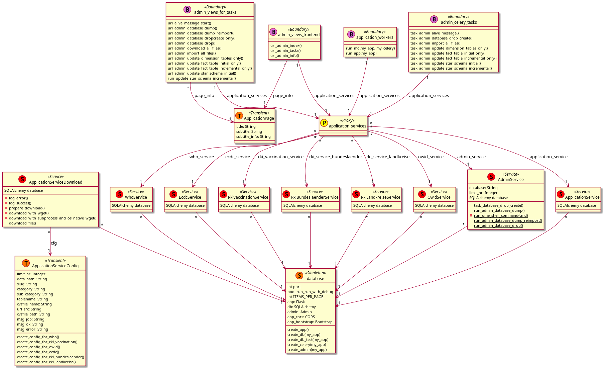
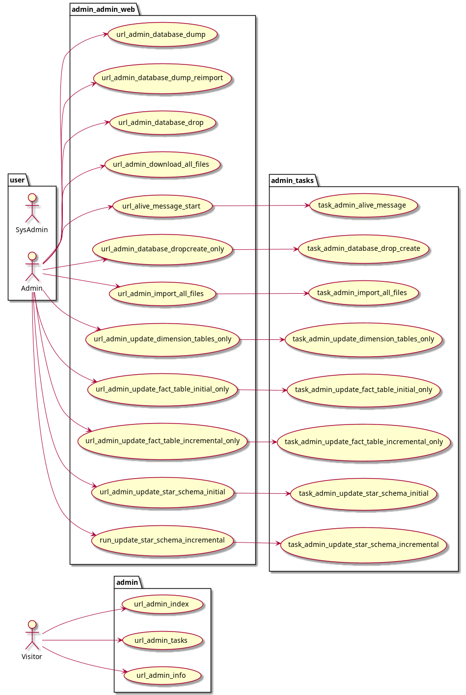
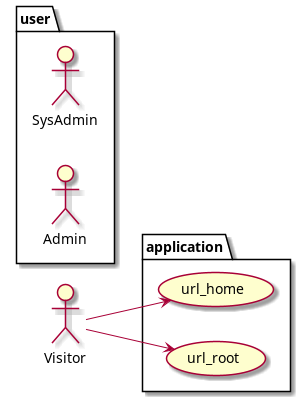
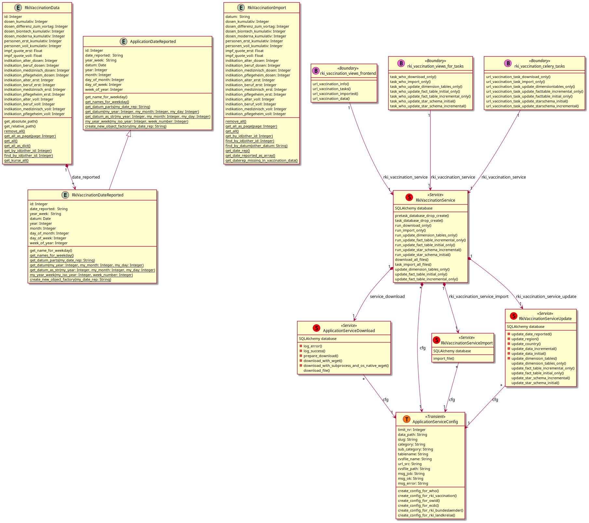
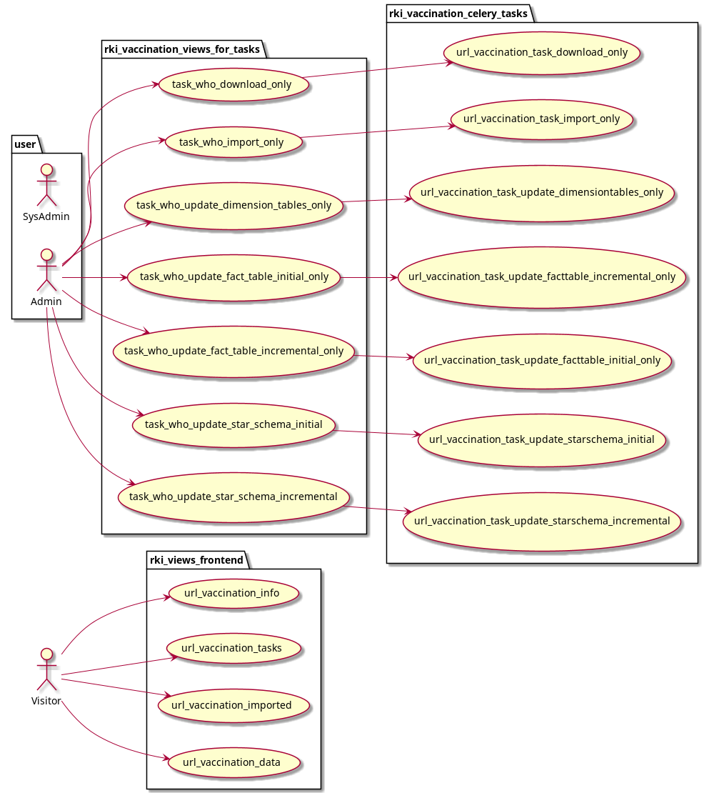
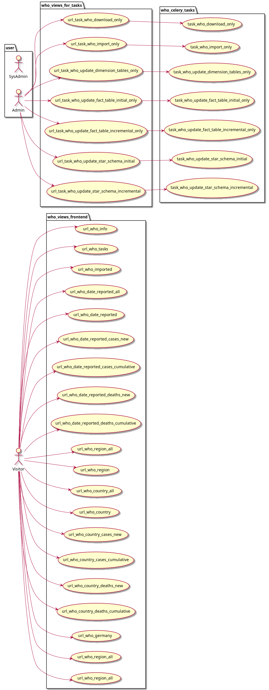

# UML Blueprints

## admin
### admin_domain_model

### admin_use_cases

## application
### application_domain_model

### application_use_cases

## ecdc
### ecdc_domain_model

### ecdc_use_cases

## owid
### owid_domain_model

### owid_use_cases

## rki_vaccination
### rki_vaccination_domain_model

### rki_vaccination_use_cases

## who
### who_domain_model

### who_use_cases

